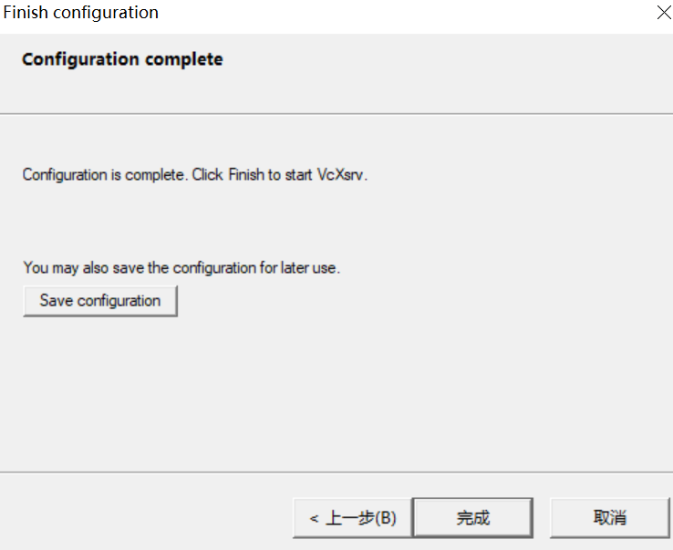

## 问题

在学习`强化学习`时用到gym。在Windows上跑gym总有诸多不便，所以直接将环境切到Linux下。开始方案是使用Win 10的Ubuntu子系统wsl2。按照网上教程虽然没有弄明白原理但是还算顺利，Linux的Gui程序还是能正常跑起来的。最近双11腾讯云搞促销就卖了3年的云主机，买了以后发现自己也没什么需要放在上面跑的东西，就寻思能不能将gym环境搬到云上，这样也就省得在公司机器和家里的机器上来回切换的麻烦了。但是今天在操作的时候还是遇到了不少的问题，现在记录下来以作备忘。


## 解决方法	

1. 首先到SourceForge上下载最新的[VcXsrv](https://sourceforge.net/projects/vcxsrv/)

2. 安装运行

3. 启动后出现如下界面：

   

   这里有两个选项，第一个是程序的窗口风格：

   1.  Multiple windows: 多窗口模式，即每个GUI进程一个窗口

   2. One large windows: 单窗口模式，和远程桌面类似，所有窗口都在一个大窗口里

   3. Fullscreen：全屏模式，与单窗口模式类是只不过大窗口是全屏的

   4. One window without titlebar: 与标题单窗口模式，与单窗口模式类似

   可以更具需求自己的喜好随便选择就可以了。

   窗口模式选项下面是Display number选项，这个选项很重要，但是大多数的教程里面都没有介绍这个选项的意义，害的我在后面解决云主机连接时一直忽略了这个选项，走了挺多弯路。这个选项代表的是vcXsrv模拟的是第几个显示器的意思，说他重要是因为它和通信有着直接的关系。看了别人的教程和使用后你可能心中会有个疑问，vcXsrv毕竟是个网络服务器，但是怎么就是找不到设置和修改服务端口的地方呢？**其实这里的的Display number干的就是这件事，x server使用的端口其实是个‘’知名‘’端口(6000)，而实际使用的端口为6000+(Display Number), 比如如果你设置为0，那么服务监听端口变为6000，而如果是1，则端口为6001，依次类推**。

   后面一个界面没什么好说的，选“start no client”好了。

   

   下一个界面：

   

   有个选项挺重要的，Disable access control 这个选项必须勾选否则会出现认证失败的提示。

   ```bash
   root@H:~# xcalc
   Authorization required, but no authorization protocol specified
   Error: Can't open display: 172.30.128.1:0
   ```

   最后一个界面：

   

   有个save configuration的按钮，它可以将你前面的设置保存到一个以`.xlaunch`为后缀的文件中，以后只要双击这个文件就可以使用同样的配置了，一下是我的配置：

   ```xml
   <?xml version="1.0" encoding="UTF-8"?>
   <XLaunch WindowMode="MultiWindow" ClientMode="NoClient" LocalClient="False" Display="0" LocalProgram="xcalc" RemoteProgram="xterm" RemotePassword="" PrivateKey="" RemoteHost="" RemoteUser="" XDMCPHost="" XDMCPBroadcast="False" XDMCPIndirect="False" Clipboard="True" ClipboardPrimary="True" ExtraParams="" Wgl="False" DisableAC="True" XDMCPTerminate="False"/>
   ```

   4. 软件安装完，启动后windows这边事情就结束了。

   5. 在Linux机器上，我们需要设置下DISPLAY环境变量，因为x client会使用此环境变量

      ```bash
      {{ hostname }}:{{ D }}.{{ S }}
      ```

      - {{ hostname }} 表示运行 X Client 的主机名（域名或 IP 地址），如果省略（如 `:0.0`）则表示使用 `localhost`。这里的hostname便是vcXsrv或者其他X Server的IP地址，在wsl上面比较简单，因为wsl虚拟机和Windows主机都在同一台机器上，所以他们在同一局域网，可以直接访问互联，只要将hostname设为主机的IP即可。这里还有个小技巧，如果写死IP地址，主机的IP变动后也要跟着改还是挺麻烦的，网上有人给出了下面的解决方案：

        ```bash
        export DISPLAY="$(grep nameserver /etc/resolv.conf | sed 's/nameserver //'):0"
        ```

        这里的脚本`$(grep nameserver /etc/resolv.conf | sed 's/nameserver //')`意思是在resolv.conf文件中查找nameserver对应的IP地址。在wsl中nameserver即虚拟机的DNS服务器被设置为桥接路由的IP，而桥接路由正好是Windows主机，所以这个地址也代表了主机地址，所以说这是个技巧而不是通用的方法。

        **总之，这个hostname一定要设置为可访问的vcXsrv服务器地址。**对于想让外网云主机上GUI运行在本地机器的情况稍微有点麻烦。因为本地的主机通常隐藏在本地局域网中，外网不能直接访问。
      
        在这里我采取的方法是使用ssh的端口映射将Windows本地主机上的vcXsrv服务端口映射到远程云主机的本地端口上，实现将X Client的数据流转发到vcXsrv服务器上。方法很简单只需要在普通的ssh连接参数上添加`-R`参数：
      
        ```bash
        ssh -R localhost:6000:localhost:6000 username@server
        ```
      
        前面的localhost:6000代表windows本地的地址和端口，后面的代表Linux的地址和端口。这样Linux机器上的程序访问6000端口就会转发到Windows机器上的6000端口。原理就是ssh连接成功后便会自动添加指定端口的服务监听，任何访问此服务的数据都会转发到ssh客户机对应的端口上。通过ssh的端口映射，我们最终就可以在远程云主机上访问本地Windows上的vcXsrv服务了。
      
        接下来我们只需要设置DISPLAY环境变量为:
      
        ```bash
        export DISPLAY=localhost:0
        ```
      
        便可以了。
      
        
      
      - {{ D }} 是一个序列号，一个 X 连接使用一个序列号，如果有多个 X Client 向外连接，则必须使用不同的 {{ D }}。并且它与一对 C/S 连接使用的端口号相关，`Port = D + 6000`
      
        **这里的{{ D }}一定要与前面vcXsrv里面设置的Display number保持一致，因为这个用来计算连接端口的**
      
      - {{ S }} 是屏幕序号，一个 display 可以在多个屏幕上显示。 display 是指通过同一个 X 连接传递的窗口。如果只有一个屏幕，则使用 `0` 作为序号（多的屏幕则依次递增）
      
      

## 

[1]TCP/UDP端口列表[J]. 维基百科，自由的百科全书, 2021.

[2]VcXsrv 远程连接 · Issue #15 · zombie110year/blog-source[EB/OL]. GitHub, [2021-11-12]. https://github.com/zombie110year/blog-source/issues/15.

[3]玩转SSH端口转发[EB/OL]. [2021-11-12]. https://blog.fundebug.com/2017/04/24/ssh-port-forwarding/.
